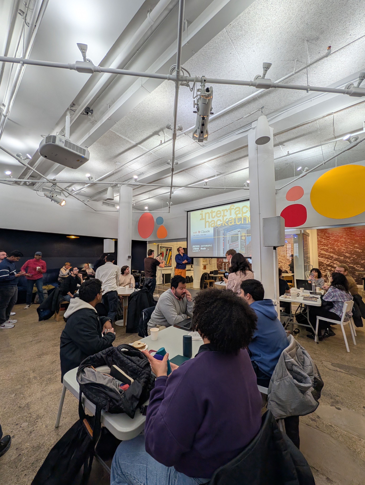
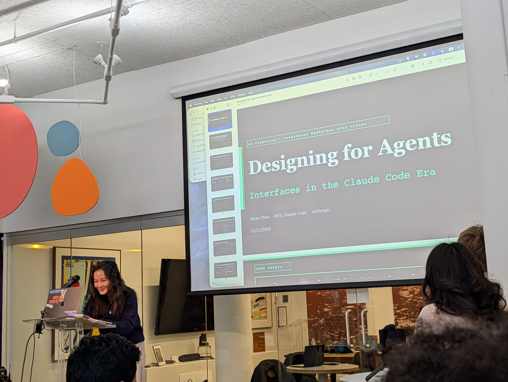
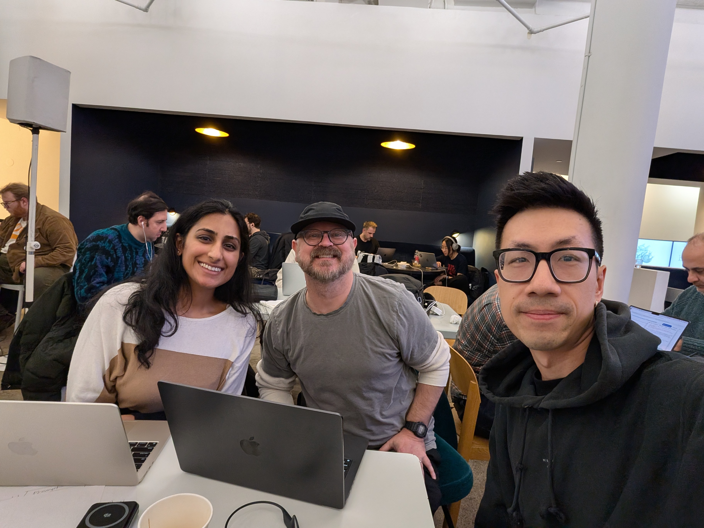

I spent this weekend at the [AI Tinkerers NYC Hackathon](https://nyc.aitinkerers.org/hackathons/h_Y-vxS47Mi6I). 

First off, we didn't win, but we got something working and I got to meet some awesome people.

The theme was about rethinking interfaces in the age of fast, capable models. That made for a fun mix of product design, prototyping, and model experimentation under real time pressure.

_Venue vibes at AI Tinkerers NYC: a packed room of teams building all day._

One highlight was seeing Karen Zhou from Anthropic's technical staff present on agents and the phases of working with agents.

_Karen Zhou from Anthropic's technical staff presenting on agents and the phases of working with agents._

After brainstorming and mix-and-matching our ideas, we finally settled on focusing on exploration and how to aid the initial prompt. We battled WIFI troubles from the start, tried going to a cafe, but ended up hotspotting so we could get work done. We moved fast, learned a lot, and built **HyperPrompter**, our hackathon project, which we were proud to demo by deadline. Rushing to record and edit the video. I used elevenlabs to generate a voiceover from a transcript generated from uploading the screencast to gemini.

I posted a quick thread right after the event [here on X](https://x.com/jhsu/status/2025337549229617224).

Our project became a desktop app called HyperPrompter. HyperPrompter is an idea-exploration studio built with [Electrobun](https://blackboard.sh/electrobun/docs/) and React that turns rough input into sharper, testable direction based on suggestions by various personas.

Instead of a linear chat interface, it treats prompting as a structured, collaborative workflow. Users orchestrate multiple personas, blend perspectives, regenerate refined prompts, and evaluate outputs against custom criteria. The goal is to refine the prompt to narrow in with the prompt and explore different paths through persona suggestions.

One key idea is extracting reusable instructions from each run so future prompting improves recursively without polluting ongoing conversations. This makes prompt refinement less trial-and-error and more like a repeatable system that can plug into different workflows.

Under the hood, we used Anthropic models for generation and Zod for structured data validation. The team was Joe (me), Rajvi, and Joaquin.

_Team HyperPrompter after demo submissions._

It was great to just talk to highly motivated builders, especially my awesome team. Though I enjoy learning about people and talking, the hackathon drained me. I think I would like to do another but maybe after I recoup my energy.
