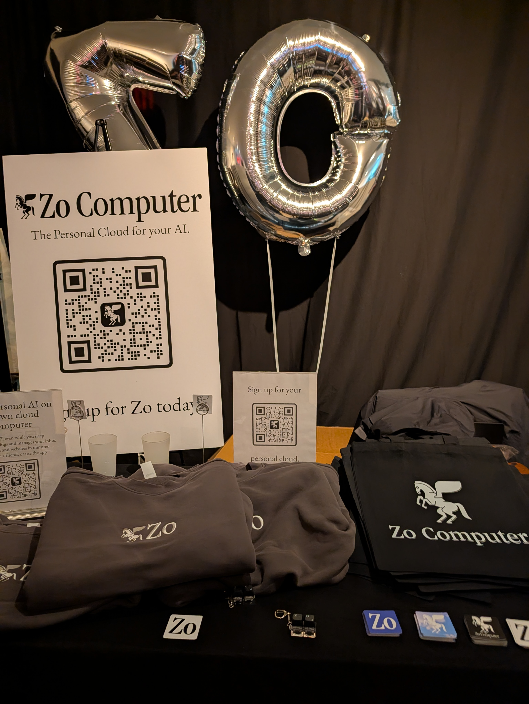
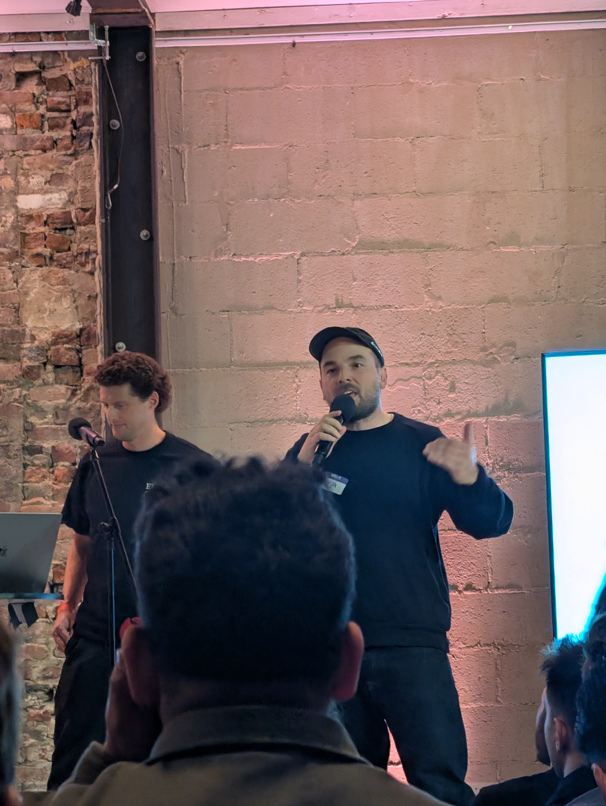
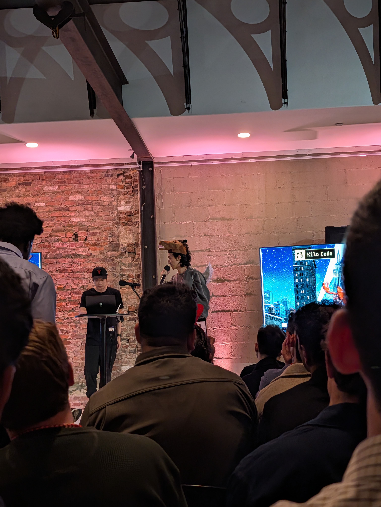

I went to [ClawCon NYC](https://luma.com/clawconnyc?tk=bC1qYa) recently, sponsored by [Kilo Code](https://kilo.ai) and [zo.computer](https://zo.computer), which I use. It was a huge event with a packed room, lobster hats in the crowd, and a lot of energy around where agent workflows are heading.

_People lining up outside ClawCon NYC, including a few excellent lobster hats._

The word of the night was **movement**.

That felt right. The vibe was less about abstract AI hype and more about people actually building, shipping, and finding useful shapes for agents in the real world.

_Zo Computer setup at the event._

One of the OpenClaw maintainers gave a kind of state of the union for the ecosystem, which made the whole thing feel bigger than just a meetup. You could feel that OpenClaw is turning into a real community with its own adjacent projects, practices, and weird, specific use cases.

_Willie Williams shares how every.to has doubled their employees by each having OpenClaw._

The demos were the best part.

_Zo.computer shares a brief history of computing and the future of personal computing._

One presentation showed **LabClaw**, a project that came out of the recent OpenClaw hackathon at Betaworks. It was built to help manage mice and lab supplies. That is exactly the kind of niche, operational workflow I love seeing agents applied to. Not "AI for everything," but tools shaped around a concrete environment and a real set of recurring tasks.

Another talk focused on running a business using OpenClaw. I liked that this was not framed as a toy demo or a futuristic concept. It was about using agents as part of the actual machinery of work.

There was also [**PassiveClaw**](https://x.com/passiveclaw), for options trading, with daily updates and two checkpoints: one in the morning and one in the afternoon. Again, very specific, very operational, very much about fitting agents into an existing rhythm rather than pretending they replace the whole thing.

What stood out most to me, though, was how many non-technical people were there and how much they were able to do. That feels important. The exciting part is not just that technical people can build more complicated automations. It is that more people can create their own automations and agents at all.

That changes the texture of these events. Instead of only feeling like developer infrastructure gatherings, they start to feel like places where new interfaces for work are being negotiated in public by the people who actually want to use them.

ClawCon NYC felt like a sign that this space is getting more legible. More users, more builders, more experiments, more movement.
