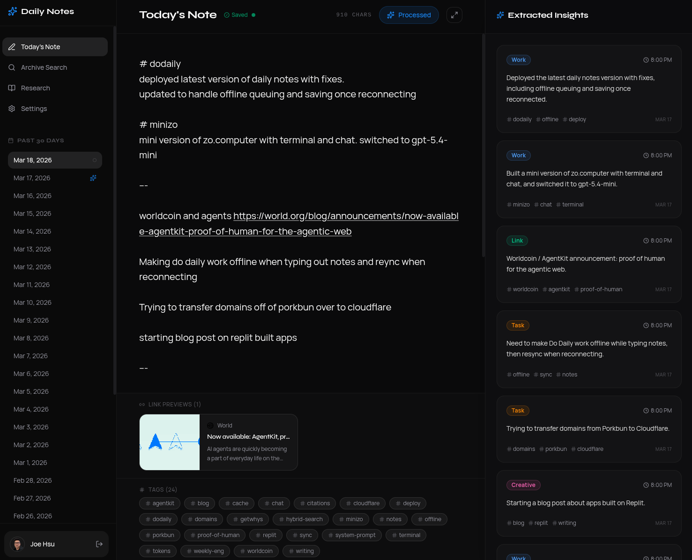
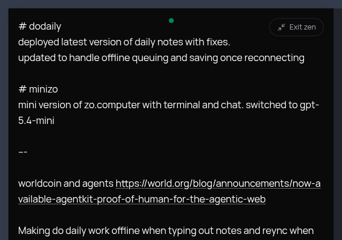
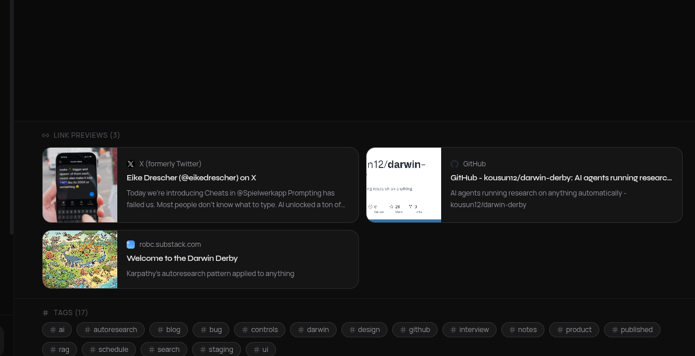

I’ve tried a lot of note-taking apps over the years. Most of them are great at helping you capture information. Very few are good at helping you actually use it later.

That gap is what led me to build [**DoDaily**](https://dodaily.replit.app/): a personal journaling and note-taking app that acts more like an **AI-powered personal knowledge base** than a traditional notes app.

The idea is simple: **write freely now, make sense of it later**.

Instead of forcing you to organize your thoughts while you’re having them, DoDaily lets you dump everything into one place, messy, fast, and unfiltered, and then uses AI to quietly structure, categorize, and connect what you wrote in the background.

At its core, it’s a two-part tool:

- a place to **write**
- a place to **think back**

## The problem I wanted to solve

The hard part of note-taking has never been writing things down. The hard part is everything that happens after.

Thoughts get buried. Interesting links pile up. Half-formed ideas disappear into archives. Something you wrote six months ago is technically “saved,” but for all practical purposes, it’s gone.

Most tools solve this by expecting you to do the organizational work upfront: add tags, sort things into folders, decide which notebook something belongs in. That friction adds up quickly, and for me, it kills the habit.

What I wanted instead was a system where I could just write, stream-of-consciousness, personal, inconsistent, whatever was in my head, and trust that the app would handle the organization later.

## How DoDaily works

### 1. Write freely

Each day gives you a single, full-screen text area.

No formatting toolbar. No folders. No pressure to structure anything. Just a blank space to write whatever is on your mind: tasks, ideas, links, feelings, observations, things you learned, or things you don’t want to forget.

It’s essentially a daily brain dump.

There’s also a **Zen Mode** that strips away everything except the text area with a single click, which makes it feel even more like writing in a private, distraction-free space.

### 2. AI processes your notes

Once you’re done writing, or automatically at midnight, the app sends your raw note text through an AI pipeline.

The model reads the entry and breaks it into **discrete, categorized chunks**. Each chunk gets labeled by type, such as:

- task
- idea
- link
- discovery
- feeling
- creative fragment

Those chunks are then stored and become the foundation for everything else in the app.

The AI can also use **personal context** you’ve provided about yourself, your work, and your projects. That makes the system much more useful than generic summarization, because it can interpret your notes in a way that’s specific to your life.

### 3. Revisit and research your own thinking

This is the part that makes DoDaily feel different from a normal notes app.

#### Archive

You can browse past days and see both the original raw note and the AI-extracted chunks that came from it.

That means your writing stays intact, but it also becomes searchable and structured in a second layer.

#### Tags

Every chunk gets tagged automatically. When you click a tag, the app generates an **AI-written wiki-style article** synthesizing everything you’ve ever written on that topic.

It also includes footnotes linking back to the exact days those ideas came from, so you can trace the synthesis back to the original writing.

#### Research

You can also ask questions in plain language.

Instead of just keyword-matching like a traditional search bar, the app searches across your note history, finds the most relevant chunks, and returns a **cited summary**. It feels less like searching and more like asking a research assistant who has read everything you’ve ever written.

That’s the moment where the whole idea really clicked for me: your notes stop being a pile of saved text and start becoming something you can actually reason with.

#### Link previews

If you paste a URL into your notes, the app automatically fetches metadata and renders it as a rich preview card with the title, description, and image.

It’s a small detail, but it makes old entries much more scannable. Your archive feels less like a wall of text and more like a visual timeline of what you were thinking about.

### 4. It works offline too

DoDaily is designed to keep working even if your connection drops.

If you lose internet in the middle of writing, your draft is saved locally in the browser and synced back to the server when the connection returns. There’s also lightweight conflict resolution, so if both a local draft and a server version exist, the app compares timestamps and helps prevent accidental overwrites.

That way, the writing experience stays reliable, which matters a lot for something meant to be used every day.

## The technical side

For anyone curious about the implementation, DoDaily is built as a monorepo with:

- **React + Vite** on the frontend
- **Node.js + Express** on the backend
- **PostgreSQL** for storage
- **OpenAI** for the AI pipeline
- **Replit Auth** for authentication

There’s also a scheduled background job that runs every hour and processes any notes from previous days that didn’t make it through the AI pipeline. It acts as a failsafe in case the server was down around midnight or something else interrupted processing.

One implementation detail I’m especially happy with is the frontend API setup: the client code is generated automatically from a typed **OpenAPI specification**, which keeps the frontend and backend in sync without a lot of manual maintenance.

## What I was aiming for

The north star for this project was simple:

> **Reduce the friction between having a thought and being able to use it later.**

Writing should feel natural, almost like talking to yourself. The structure shouldn’t be something you have to impose in real time. It should emerge after the fact.

I also wanted the “research” experience to feel fundamentally different from search. Not just “find the note where I mentioned this,” but “help me understand what I’ve been thinking about this topic over time.”

When you ask a question and get back a coherent, cited answer drawn from months of your own writing, it starts to feel like your notes are doing something new. Not just storing memory, but actively helping you think.

## Final thoughts

I built DoDaily for myself first, because it solved a problem I kept running into: I had plenty of captured thoughts, but no good way to reconnect with them.

What I ended up with is something closer to a personal knowledge system than a journal: a tool that helps turn messy daily writing into something searchable, structured, and genuinely useful.

Built on **Replit** using **React, Node.js, PostgreSQL, and OpenAI**, it’s still rooted in a simple habit: write every day, and let the system help you make sense of what you wrote.

If you want to try it, you can use DoDaily here: [https://dodaily.replit.app/](https://dodaily.replit.app/).
